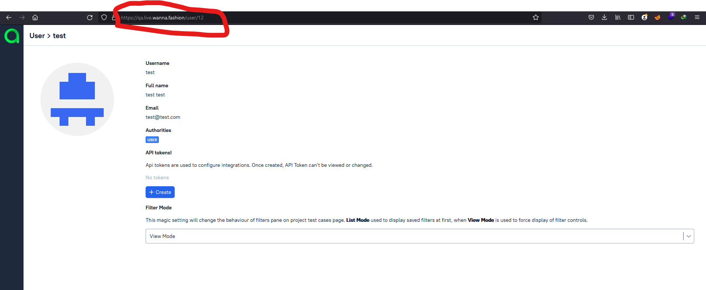
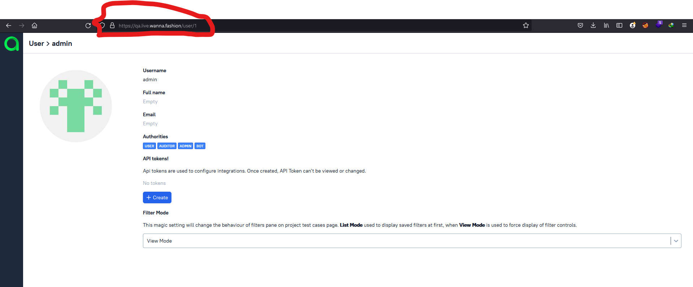

# Allure_TestOps_IDOR (CVE-2022-25588)
Allure TestOps IDOR vulnerability 

# Reproduce

- Login to your account and click on "Y our Profile"

- You can see your id is 12 on the /user/ path

- Change the user id to 1 or any other number it will show you the other user information

# PoC

# By
<a href="https://www.linkedin.com/in/ahmed-abdulhameed-729737158/">Hameed74</a> & <a href="https://www.linkedin.com/in/zer0verflow/">Zeyad Azima</a>
 
